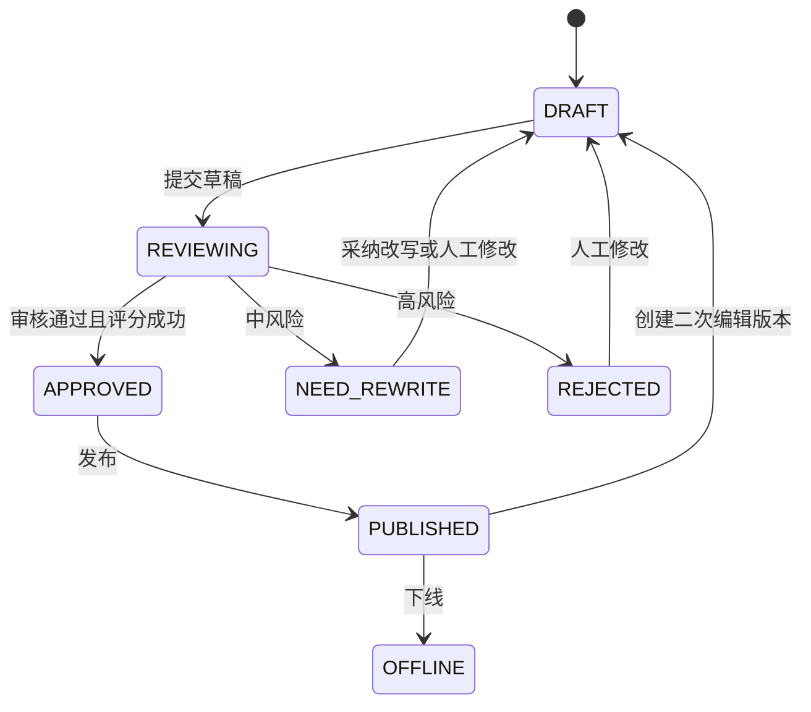

# 业务流程

## 1. 核心闭环

```text
创建内容壳
→ AI 生成候选内容
→ 用户确认并编辑草稿
→ 本地保存 + 30 秒云端快照
→ 提交草稿生成正式版本
→ mint-filter + 阿里云内容安全 + 火山方舟大模型审核
→ 审核通过后使用 @langchain/openai 质量评分
→ 发布前重新审核
→ 设置线上发布版本
→ C 端内容流、热点榜、爆文榜展示
```

AI 结果只能进入候选区，用户确认后才能写入编辑器。审核、评分或发布失败不得丢失当前草稿。

## 2. 创作与草稿

1. `POST /api/contents` 创建内容壳，初始状态为 `DRAFT`，此时可以没有正式版本。
2. `POST /api/ai/generate` 使用 Prompt、主题、素材和可选创作参数生成候选图文。
3. 生成前审核用户输入，生成后审核候选结果；任一审核服务失败时，候选结果不得提升为正式版本。
4. 用户确认候选内容后进入编辑器。
5. 前端停止输入约 2 秒后写入 IndexedDB；每 30 秒通过草稿接口保存云端快照。
6. 离线期间继续本地编辑；恢复网络后使用 `clientRevision`、`serverRevision` 和 `baseVersionId` 同步。
7. 冲突时不静默覆盖，用户选择保留本地、保留云端或复制为新草稿；复制为新草稿会创建新的内容壳和首个草稿快照，原内容与原云端草稿保持不变。

## 3. 提交审核与发布

`POST /api/contents/:id/review` 接收要提交的草稿快照：

1. 校验作者和草稿归属。
2. 将草稿提升为不可变的 `content_versions` 正式版本，并设置为 `currentVersionId`。
3. 内容进入 `REVIEWING`。
4. 执行 `mint-filter → 阿里云内容安全审核 → 火山方舟大模型审核 → 标准化决策`，结果写入 `safety_reviews`。
5. `PASS` 后使用 `@langchain/openai` 执行质量评分并写入 `quality_evaluations`。
6. 审核或评分失败时保留明确失败状态，不伪造通过结果。

发布必须满足当前版本审核通过且存在质量评分。`POST /api/contents/:id/publish` 发布前重新审核当前版本，成功后将 `publishedVersionId` 指向 `currentVersionId`，并初始化 `content_metrics`。

## 4. 双版本与状态

- `currentVersionId`：创作者当前编辑、审核或准备发布的正式版本。
- `publishedVersionId`：C 端当前公开展示的线上版本。
- `Content.status`：当前编辑版本的工作流状态。
- 内容是否公开由 `publishedVersionId` 决定；C 端不得读取未发布的 `currentVersionId`。



已发布内容二次编辑时，旧 `publishedVersionId` 继续公开，新版本从 `DRAFT` 重新审核；发布成功后才替换线上版本。下线清空 `publishedVersionId` 并设置 `OFFLINE`。

## 5. 合规改写

只有 `NEED_REWRITE` 内容可以请求合规改写。`@langchain/openai` 生成候选替代内容并保存 `rewrite_records`；用户采纳后创建新版本、回到 `DRAFT` 并重新审核。改写结果不得自动发布。

## 6. 内容消费与榜单

- 内容流、公开详情、热点榜和爆文榜只查询存在 `publishedVersionId` 的内容。
- 核心榜单因子仅为质量分、阅读热度和发布时间，实时计算且不保存排名快照。
- 热点榜表示站内热门内容榜，不等同于外部热点数据。
- 点赞、分享等用户反馈仅作为进阶智能排序加分项。

## 7. 故障原则

- 审核服务不可用或返回无法解析：禁止提升为可发布版本，禁止发布。
- `ChatOpenAI` 评分失败或结构校验失败：不保存正式评分，禁止发布。
- AI 生成失败：保留编辑器和草稿，允许重试。
- 云端草稿保存失败：保留 IndexedDB 最新内容并标记待同步。
- 榜单计算异常：降级为质量分与发布时间排序，不伪造互动数据。
