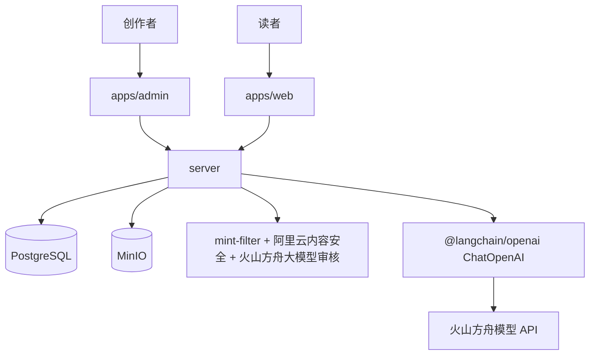
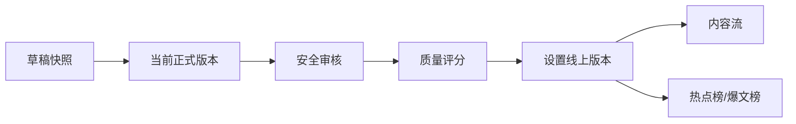

# 总体架构

## 1. 系统边界

项目采用 pnpm + Turborepo 管理的轻量 Monorepo：

```text
apps/admin   B 端创作者中心
apps/web     C 端内容前台
server       NestJS 模块化单体 API
packages     共享配置与类型
docs         需求、流程、设计与规则
```

核心技术为 React 19、Next.js 16、NestJS 11、Prisma 7、PostgreSQL 和 MinIO。不使用 Redis、BullMQ、微服务或额外数据库。

## 2. 模块依赖



- B 端负责创作、草稿、审核反馈、评分、改写和站内发布。
- C 端负责已发布内容流、公开详情、热点榜和爆文榜。
- 后端统一处理认证、资源归属、版本、AI 调用、审核、发布和榜单查询。
- PostgreSQL 保存业务状态和调用记录；MinIO 保存上传素材。

## 3. 数据流



当前正式版本与线上发布版本分离。创作者二次编辑不会覆盖 C 端正在展示的版本。

## 4. 核心与加分项

核心架构只承载原始需求必做闭环。以下能力独立实现，不得让其增加核心流程复杂度：

- 用户反馈与智能排序。
- 外部热点 API 导入。
- 外部平台一键分发。

## 5. 当前完成度

用户认证、Prompt、素材、内容壳、云端草稿、AI 候选生成与通用预检模块已完成。其他前后端页面、Controller、Service 或榜单代码仍视为脚手架、演示或实现参考，不代表目标能力已完成。具体完成范围与验证证据见 `docs/dev`。
