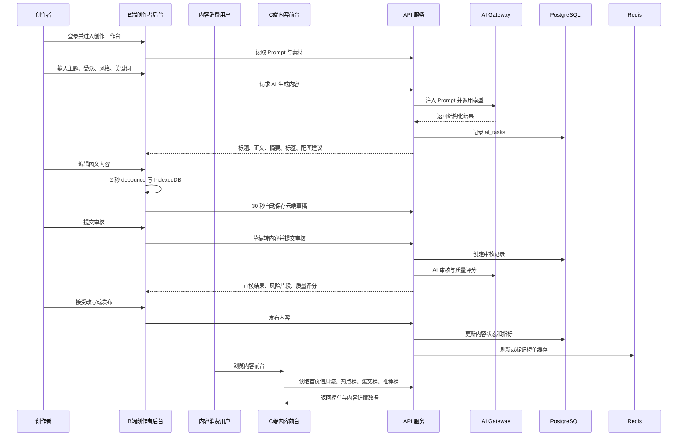
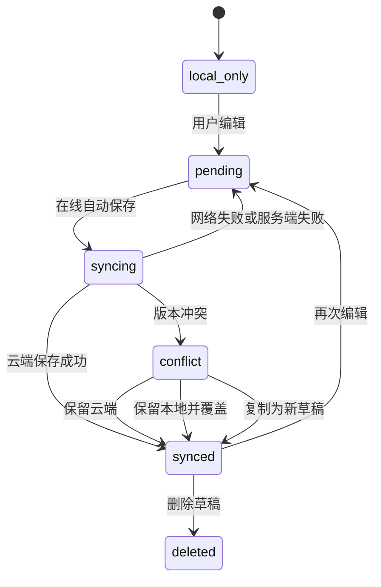
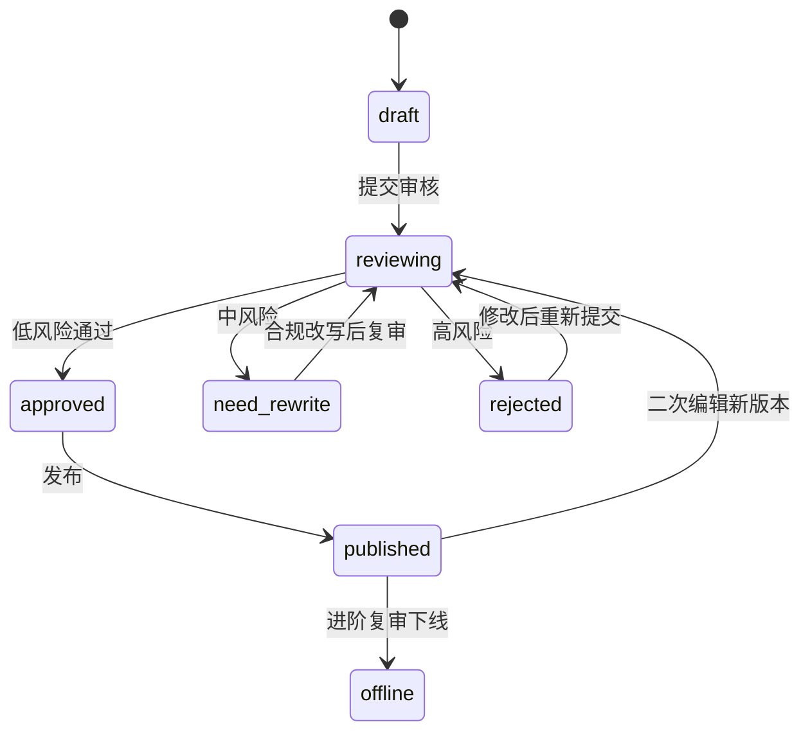
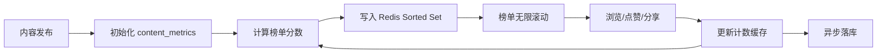

# 流程：业务流程与状态机

## 主业务链路



## 创作流程

1. 用户选择创作类型、目标平台、受众、风格和关键词。
2. 用户选择 Prompt 模板和素材。
3. 前端将创作参数提交给 `POST /api/ai/generate-content`。
4. 后端根据 Prompt 模板、素材描述和用户输入组装模型上下文。
5. AI Gateway 要求模型输出结构化 JSON。
6. 后端校验输出结构，失败时尝试一次 JSON 修复。
7. 前端把生成结果放入候选区，由用户决定插入或替换正文。
8. 编辑过程同时触发本地保存和云端自动保存。

AI 候选区不直接覆盖编辑器内容，这是为了保留“人机协同”的产品体验，也避免模型异常输出污染当前草稿。

## 草稿状态机



草稿同步原则：

- 本地优先，确保不丢稿。
- 云端使用版本号进行乐观锁。
- 冲突不自动合并，由用户选择处理方式。
- 删除草稿使用软删除，避免离线队列延迟造成误删。

## 内容审核状态机



关键约束：

- 只有 `approved` 内容可以发布。
- `rejected` 内容不能发布，只能修改后重新审核。
- `need_rewrite` 内容可以触发合规改写，但改写后仍必须复审。
- `published` 内容二次编辑不直接覆盖线上版本，建议生成新版本审核。

## 审核与发布流程

```text
提交审核
  -> 创建 moderation_records
  -> 规则库关键词/正则审核
  -> AI 语义审核
  -> 生成风险等级、类别、片段、理由、建议
  -> 生成质量评分
  -> 根据决策进入 approved / need_rewrite / rejected
```

决策逻辑：

```text
if ruleHitHighRisk:
  decision = reject
else if aiRiskLevel == high:
  decision = reject
else if aiRiskLevel == medium:
  decision = need_rewrite
else:
  decision = pass
```

发布接口必须在服务端事务中完成：

1. 校验用户是作者。
2. 校验内容状态是 `approved`。
3. 查询最新审核记录，确认 `decision = pass`。
4. 更新内容状态为 `published`。
5. 写入发布时间。
6. 初始化或更新 `content_metrics`。
7. 标记榜单需要刷新。

## 合规改写流程

```text
审核中风险或驳回
  -> 用户点击一键合规改写
  -> 后端读取风险类别、风险片段、审核理由
  -> AI Gateway 生成合规版本
  -> 前端展示改写前后对比
  -> 用户接受改写
  -> 更新草稿或待审核内容
  -> 重新提交审核
```

改写原则：

- 尽量保留原主题、表达意图和结构。
- 删除或弱化高风险表达。
- 输出 changedSpans，便于前端展示 Diff。
- 改写后不自动发布，必须再次审核。
- 改写记录持久化到 `rewrite_records`。

## 榜单与阅读数据流程



阅读与互动策略：

- 浏览按用户、内容、时间窗口去重。
- 点赞按用户 + 内容 + 类型唯一，重复点击表示取消。
- 分享按内容计数，作为爆文榜互动因子。
- 收藏、举报、不感兴趣等反馈放入进阶挑战，不作为当前主链路硬依赖。

## 异常与降级流程

- AI 生成失败：返回模板内容或提示重试，不影响草稿编辑。
- AI 审核失败：内容不可发布，允许用户重试或使用规则库结果。
- 质量评分失败：降级为启发式评分，记录失败原因。
- Redis 不可用：榜单降级为 PostgreSQL 索引排序，限制数量。
- 云端保存失败：保留 IndexedDB 最新内容，标记为待同步。
- 对象存储失败：素材上传失败但不影响已有草稿编辑。
