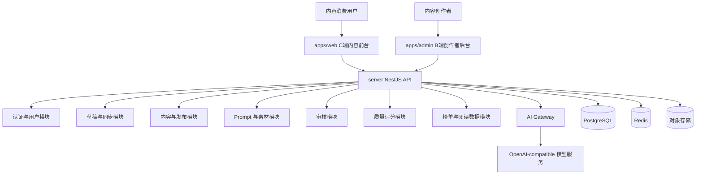
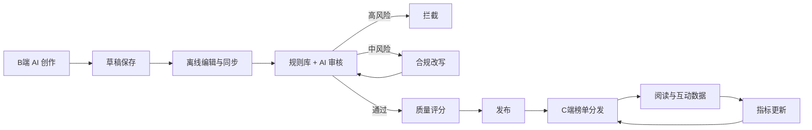

# 架构：系统总体设计

采用轻量 Monorepo + 模块化单体。前端分为 C 端内容前台和 B 端创作者后台：C 端负责内容消费与榜单分发，B 端负责创作者生产、审核反馈、发布和分发管理

## 逻辑分层





## 一、整体设计

### 1.1. 当前结构

使用 Turborepo + pnpm + Monorepo 统一管理整个项目

```
xingliu/
├── .vscode/                       # VS Code 工作区配置
├── .husky/                        # Git hooks
├── docs/                          # 项目文档
├── apps/                          # 前端应用目录
│   ├── web/                       # C 端内容前台，Next.js
│   |   ├── src/                   # 前端源码目录
|   |
│   └── admin/                     # B 端创作者后台，Vite + React
│       ├── src/                   # 前端源码目录
|
├── server/                        # 后端 API 服务，NestJS
│   ├── src/                       # 后端源码目录
│   ├── libs/                      # 后端公共库
│   ├── prisma/                    # Prisma 数据库目录
|
├── packages/                      # 共享包目录
│   ├── config/                    # 共享配置包
│   └── shared/                    # 共享类型
|
├── .dockerignore                  # Docker 忽略规则
├── .editorconfig                  # 编辑器通用格式约束
├── .env                           # 环境变量配置
├── .env.example                   # 环境变量配置示例
├── .gitattributes                 # Git 文本属性与换行处理
├── .gitignore                     # Git 忽略规则
├── .oxlintrc.json                 # Oxlintrc 配置
├── .prettierignore                # Prettier 忽略规则
├── .prettierrc                    # Prettier 格式化规则
├── Caddyfile                      # 本地域名反向代理配置
├── commitlint.config.cjs          # Commitlint 配置
├── docker-compose.prod.yml        # 生产环境 Docker Compose 配置
├── docker-compose.yml             # 开发环境 Docker Compose 配置
├── Dockerfile.admin               # 生产环境 Dockerfile for Admin
├── Dockerfile.web                 # 生产环境 Dockerfile for Web
├── Dockerfile.server              # 生产环境 Dockerfile for Server
├── nginx.conf                     # 生产环境 Nginx 配置
├── package.json                   # 根依赖与脚本配置
├── pnpm-lock.yaml                 # pnpm 锁文件
├── pnpm-workspace.yaml            # pnpm 工作区配置
├── README.md                      # 项目说明
└── turbo.json                     # Turborepo 任务配置
```

### 1.2 技术选型及其说明

1. 采用 Turborepo + pnpm 管理 Monorepo，统一调度 `apps/*`、`server` 和 `packages/*`。
2. 采用 ESLint + Prettier + EditorConfig 约束代码质量、格式化风格和编辑器行为。
3. 采用 Commitlint + Husky + Commitizen 规范提交信息，便于生成变更日志和版本管理。
4. 采用 Caddy 做本地域名反向代理，让 Admin、Web、API 在固定域名下联调。

### 1.3 反向代理设计

```
┌──────────────────────────────────────────────────────────┐
│                     用户浏览器 / 外部访问                 │
└───────────────────────────┬──────────────────────────────┘
                            │ (80/443)
┌───────────────────────────▼──────────────────────────────┐
│                     🔄 Caddy 反向代理                    │
│                  (根据域名转发到不同后端)                 │
└──────┬─────────────────┬────────────────────┬────────────┘
       │                 │                    │
       │ (/admin)        │ (/)                │ (/api)
       │ 8081            │ 8080               │ 3000
       ▼                 ▼                    ▼
┌──────────────┐  ┌──────────────┐  ┌──────────────────┐
│  Admin App   │  │  Web App     │  │  Server App      │
│ (Nginx+SPA)  │  │ (Next.js)    │  │ (NestJS)         │
│              │  │              │  │                  │
│ react-admin  │  │ next.js web  │  │ API endpoints    │
└──────────────┘  └──────────────┘  │                  │
                                    └─────────┬────────┘
                                              │
                                              ▼
                                      ┌──────────────┐
                                      │  PostgreSQL  │
                                      │  Database    │
                                      └──────────────┘
```

## 二、前端部分

### 2.1 C 端内容前台

C 端内容前台主要负责内容消费用户的浏览体验，包括首页信息流、热点榜、爆文榜、推荐榜和内容详情页。

#### 2.1.1 技术选型及其说明

- Next.js 16 + React 18 + TypeScript。
- Tailwind CSS 4。
- Zustand 状态管理。
- TanStack Query：管理 API 请求、缓存、重试、分页和加载状态。
- Next Image：优化榜单和详情页图片加载。

选择理由：

- Next.js 适合快速构建线上 Demo，并支持榜单页 SSR 或服务端预取。
- C 端只承载首页信息流、热点榜、爆文榜、推荐榜和内容详情页，首屏性能与 SEO/分享卡片更重要。
- React 生态适合榜单切换、无限滚动、阅读互动和详情页状态反馈。

### 2.2 B 端创作者后台

B 端创作者后台主要负责 AI 内容创作、编辑和分发，包括登录注册、创作工作台、AI 创作编辑器、Prompt 管理、素材管理、内容管理和审核结果。

#### 2.2.1 技术选型及其说明

当前 `apps/admin` 使用 Vite + React，定位为 B 端创作者后台。

- Vite + React + TypeScript：快速构建创作者后台与复杂工具界面。
- Tailwind CSS 。
- Zustand：管理登录态、编辑器状态、同步状态和局部 UI。
- TanStack Query：管理 Prompt、素材、草稿、内容、审核结果和分发数据。
- Tiptap：承载图文富文本编辑器。
- Dexie.js：封装 IndexedDB，实现本地草稿和同步队列。

- 登录注册：创作者账号注册、登录、退出。
- 创作工作台：草稿、已发布内容、审核状态、质量分概览。
- AI 创作编辑器：图文生成、候选区、富文本编辑、自动保存和离线恢复。
- Prompt 管理：系统 Prompt、个人 Prompt、分类、变量、版本说明。
- 素材管理：素材上传、素材库、标签、基础合规状态。
- 内容管理：草稿、审核中、需改写、已发布、二次编辑和更新。
- 审核结果：风险等级、风险片段、质量评分、一键合规改写。
- 分发中心：发布后内容在热点榜、爆文榜、推荐榜中的表现和排序解释。

## 三、后端部分

当前 `server` 使用 NestJS 11 + TypeScript; 以模块化单体推进：

- NestJS Module：认证、用户、Prompt、素材、草稿、内容、审核、评分、改写、榜单、AI Gateway。
- Prisma ORM：数据库模型、迁移和 seed。
- Redis：榜单缓存、阅读热度计数、限流和短期详情缓存。
- Swagger/Scalar/OpenAPI：生成接口说明，便于联调。
- jwt：实现双token认证授权，保护 API 安全。

后端基础能力：

- 全局异常过滤器：统一错误码、错误消息。
- 全局响应拦截器：统一响应格式。
- 服务前端所需的基础API功能

## 四、packages 部分

`packages` 目录下的共享包：

- `config`：共享配置，如环境变量、日志配置、API 相关常量等。
- `shared`：共享类型定义，如用户、内容、Prompt、审核结果等核心

## 五、数据库部分

使用 PostgreSQL，结合 Prisma 进行数据建模、迁移和访问。核心表包括用户、Prompt、素材、内容、审核记录、质量评分和榜单表现。

优势:

- PostgreSQL 支持复杂查询、事务和 JSONB 字段，适合内容平台的多样化数据需求。
- Prisma 提供类型安全的数据库访问，提升开发效率和代码质量。
- Prisma 不用写 SQL，便于数据库迁移和重构。

## 六、环境版本

1. Node.js: v24.11.1
2. pnpm: 10.25.0
3. nest: 11.0.14
