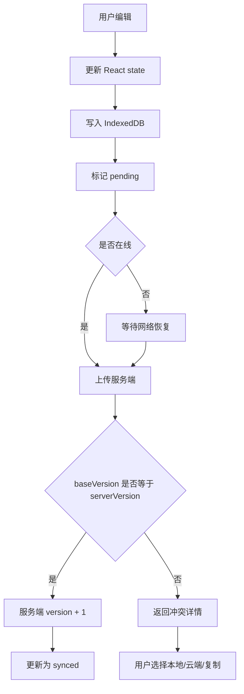

# 前端：离线草稿与同步设计

## 设计目标

离线草稿设计服务于 B 端创作者后台，第一原则是“不丢稿”。创作者在网络波动、页面刷新、关闭重开后，都应该能找回最近编辑内容。MVP 不做多人协同，不引入 CRDT/OT，只解决单用户多端或单端离线编辑的版本冲突。

## 保存策略

本地保存：

- 用户输入后立即更新 React state。
- 500ms 到 2s debounce 写入 IndexedDB。
- 写入后显示“本地已保存”。
- 离线状态下继续允许编辑。

云端保存：

- 在线时每 30 秒调用 `PUT /api/drafts/:id/autosave`。
- 手动保存时立即同步。
- 服务端使用 `version` 字段进行乐观锁。
- 保存成功后更新 `serverDraftId`、`serverVersion` 和 `lastSyncedAt`。

## IndexedDB 表设计

`local_drafts`：

```text
localDraftId        本地草稿 ID
serverDraftId       云端草稿 ID，可为空
title               标题
content             HTML 或 Markdown 正文
contentJson         编辑器 JSON
assets              素材引用
baseVersion         上次同步时的云端版本
localVersion        本地编辑版本
syncStatus          local_only | pending | syncing | synced | conflict
updatedAt           本地更新时间
lastSyncedAt        最近同步时间
deletedAt           软删除时间
```

`sync_queue`：

```text
id
type                upsert_draft | delete_draft
localDraftId
payload
retryCount
nextRetryAt
createdAt
```

## 同步算法



服务端规则：

- `serverDraftId` 为空：创建云端草稿，返回新 ID 和版本号。
- `baseVersion == serverVersion`：允许覆盖，服务端版本加 1。
- `baseVersion < serverVersion`：拒绝覆盖，返回云端草稿用于冲突处理。
- 删除草稿做软删除，避免离线队列延迟导致误删。

## 冲突处理

冲突弹窗提供三个选择：

1. 保留本地版本：用本地内容覆盖云端，服务端版本加 1。
2. 保留云端版本：丢弃本地 pending 内容，更新 IndexedDB 为云端内容。
3. 复制为新草稿：保留云端原草稿，并把本地内容创建为一个新草稿。

MVP 不做自动合并，原因是富文本结构、素材引用和 AI 候选结果合并成本较高，且答辩更关注可解释和不丢稿。

## 前端状态提示

建议在编辑器顶部或侧栏展示同步状态：

- 本地已保存。
- 云端同步中。
- 云端已同步。
- 离线编辑中。
- 待同步。
- 存在冲突。
- 同步失败，可重试。

必须联网的动作：

- 提交审核。
- 发布内容。
- 素材上传。
- AI 生成、审核、评分、改写。

离线时这些按钮应禁用或提示联网后继续。

## API 设计

创建草稿：

```text
POST /api/drafts
```

自动保存：

```text
PUT /api/drafts/:id/autosave
```

同步队列：

```text
POST /api/drafts/sync
```

请求示例：

```json
{
  "clientId": "creator-console-client-uuid",
  "drafts": [
    {
      "localDraftId": "local-uuid",
      "serverDraftId": "server-uuid-or-null",
      "baseVersion": 3,
      "localVersion": 4,
      "title": "草稿标题",
      "content": "草稿正文",
      "contentJson": {},
      "updatedAt": "2026-05-22T10:00:00Z"
    }
  ]
}
```

响应示例：

```json
{
  "results": [
    {
      "localDraftId": "local-uuid",
      "serverDraftId": "server-uuid",
      "status": "synced",
      "serverVersion": 5
    }
  ]
}
```

冲突响应：

```json
{
  "results": [
    {
      "localDraftId": "local-uuid",
      "serverDraftId": "server-uuid",
      "status": "conflict",
      "serverVersion": 6,
      "serverDraft": {
        "title": "云端标题",
        "content": "云端正文",
        "updatedAt": "2026-05-22T10:05:00Z"
      }
    }
  ]
}
```

## 验收场景

- 编辑器输入后刷新页面，本地草稿仍存在。
- 离线编辑后关闭页面，重新打开仍能恢复内容。
- 在线编辑超过 30 秒，云端版本号递增。
- 恢复网络后 pending 草稿自动同步。
- 云端版本比本地 baseVersion 更新时，出现冲突处理弹窗。
- 选择复制为新草稿后，原云端草稿不被覆盖。
- 自动保存失败时，用户仍能继续编辑，且本地内容不丢失。
