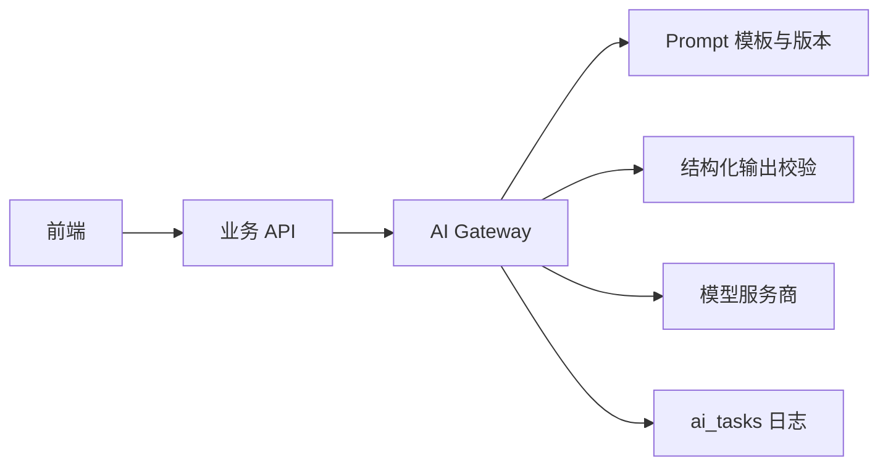

# AI：能力与 Prompt 设计

## AI 能力边界

AI 在本项目中不是单独的写作按钮，而是贯穿以下链路：

- 内容生成：标题、正文、摘要、标签、配图建议。
- 辅助编辑：续写、标题优化、风格调整。
- 内容审核：识别风险等级、风险类别、风险片段和建议。
- 合规改写：基于审核结果生成更安全的版本。
- 质量评分：从原创性、可读性、结构、价值、标题、图文匹配、合规性等维度评分。
- 榜单解释：说明内容进入榜单或排名靠前的原因。

## AI Gateway 职责

AI Gateway 是后端所有模型调用的唯一入口：



职责清单：

- 统一模型配置、baseURL、apiKey 和超时时间。
- 统一 Prompt 模板加载、变量注入和版本管理。
- 统一 JSON Schema 或 zod 校验。
- 统一重试、超时、错误码和降级策略。
- 统一记录 `ai_tasks`，包括输入摘要、输出摘要、token、耗时、错误信息。
- 统一敏感信息脱敏，避免把手机号、邮箱、token 等写入模型日志。

## 服务接口建议

```ts
interface AiGatewayService {
  generateContent(input: GenerateContentInput): Promise<GenerateContentOutput>;
  moderateContent(input: ModerateInput): Promise<ModerationResult>;
  scoreQuality(input: QualityScoreInput): Promise<QualityScoreResult>;
  rewriteCompliance(input: RewriteInput): Promise<RewriteResult>;
  generateImagePrompt(input: ImagePromptInput): Promise<ImagePromptResult>;
}
```

## Prompt 版本化

每次 AI 任务建议记录以下字段：

```text
prompt_id
prompt_version
prompt_name
model_provider
model_name
temperature
input_hash
```

版本化的意义：

- 后续 Prompt 修改后，仍能解释历史审核和评分结果。
- 可以对比不同 Prompt 的通过率、误杀率和输出稳定性。
- 出现异常时可以回滚到上一版本 Prompt。

## 内容生成输出

```json
{
  "titles": ["标题 1", "标题 2"],
  "summary": "摘要",
  "outline": ["段落 1", "段落 2"],
  "content": "正文",
  "imageSuggestions": [
    {
      "position": "开头",
      "description": "图片描述",
      "prompt": "配图生成提示词"
    }
  ],
  "tags": ["标签 1", "标签 2"]
}
```

生成策略：

- 不直接覆盖编辑器内容，先进入候选区。
- 用户点击插入、替换或追加后才写入编辑器。
- 生成标题、正文和摘要可以拆分为不同任务，降低单次输出失败风险。
- 高频接口需要用户级限流。

## 审核输出

```json
{
  "riskLevel": "low | medium | high",
  "decision": "pass | need_rewrite | reject",
  "categories": [
    {
      "category": "risk_category",
      "confidence": 0.96,
      "reason": "风险原因"
    }
  ],
  "riskSpans": [
    {
      "text": "疑似风险片段",
      "start": 10,
      "end": 20,
      "category": "risk_category",
      "severity": "high",
      "suggestion": "处理建议"
    }
  ],
  "safetyScore": 20,
  "summary": "审核摘要",
  "suggestions": ["建议 1", "建议 2"]
}
```

审核策略：

- 规则库先执行，AI 后执行。
- 高风险规则命中可直接驳回。
- AI 输出用于语义判断、风险片段定位和解释。
- 审核失败时不允许发布，可重试或降级为规则库审核。

## 质量评分输出

```json
{
  "totalScore": 86,
  "originalityScore": 82,
  "readabilityScore": 90,
  "structureScore": 85,
  "valueScore": 88,
  "titleScore": 84,
  "imageTextMatchScore": 80,
  "complianceScore": 95,
  "level": "A",
  "reasons": ["结构完整", "表达流畅"],
  "improvements": ["增加案例", "强化结尾行动建议"]
}
```

## 合规改写输出

```json
{
  "rewrittenTitle": "合规标题",
  "rewrittenContent": "合规正文",
  "changedSpans": [
    {
      "source": "原表达",
      "target": "改写表达",
      "reason": "降低违规风险"
    }
  ],
  "summary": "已降低风险并保留原主题。",
  "needReviewAgain": true
}
```

改写边界：

- 不扩展为新主题。
- 不引入未经用户提供的新事实。
- 不改变作者核心观点。
- 不自动发布，必须重新提交审核。

## 模型调用策略

- 默认超时 20 到 30 秒。
- 网络错误或 5xx 最多重试 1 次。
- JSON 解析失败时，请求模型修复为合法 JSON 1 次。
- 生成失败可返回模板内容。
- 审核失败时内容不可发布。
- 评分失败可降级为启发式评分。
- 模型不可用时，榜单使用上一轮缓存。

## AI 治理

- 多模型路由：保留 `modelProvider` 和 `modelName` 字段，后续按任务类型选择模型。
- 成本控制：按用户、任务类型、日期统计 token 和调用次数。
- Prompt 评测：核心 Prompt 修改后跑固定评测集。
- 输出可解释：审核、评分和排序都必须有理由。
- 数据合规：发送给模型前裁剪字段并脱敏敏感信息。
- 审计追踪：保存 AI 任务 ID、Prompt 版本、模型名、输出摘要和决策结果。
