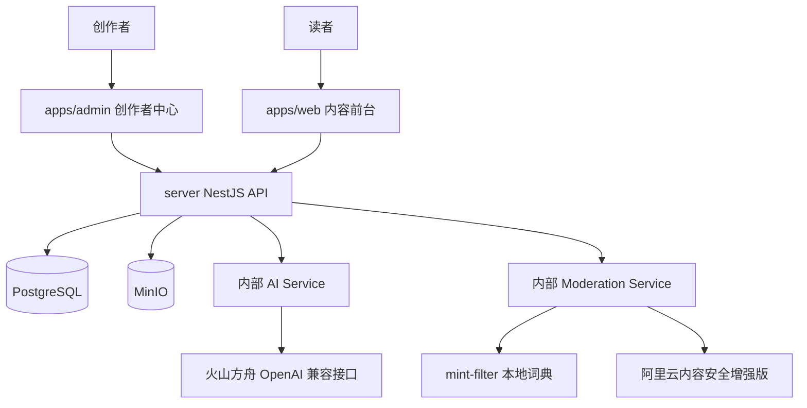
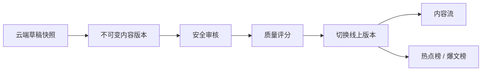

# 项目技术文档

## 1. 系统架构设计

星流采用 pnpm workspace + Turborepo 管理的 Monorepo 架构，整体由 C 端内容前台、B 端创作者中心、NestJS API、PostgreSQL、MinIO、AI 服务和内容安全服务组成。系统边界保持单体清晰，前端只通过 `/api/*` 访问后端业务能力，不直接连接数据库、对象存储或模型供应商。



核心数据流：



创作者在 Admin 端创建内容壳、保存草稿并发起 AI 生成。后端先审核输入，再通过内部 AI Service 生成候选内容，候选不会自动写入正式版本。用户提交审核时，草稿提升为不可变 `ContentVersion`，通过安全审核和质量评分后才能发布。发布只切换 `publishedVersionId`，二次编辑不会覆盖 C 端正在展示的旧线上版本。

## 2. 技术选型与理由

| 层级 | 选型 | 理由 |
| --- | --- | --- |
| Monorepo | pnpm workspace + Turborepo | 前端、后端、共享类型和共享配置在同一仓库内协作，便于统一构建和边界管理。 |
| C 端前台 | Next.js 16 + React 19 + Tailwind CSS + Radix UI | 适合内容流、榜单和详情页，便于做首屏渲染、路由分层和渐进加载。 |
| B 端创作者中心 | Vite 8 + React 19 + React Router 7 + Ant Design 6 + Tiptap | 更适合强交互创作台，Ant Design 承担表单和后台组件，Tiptap 承担富文本编辑。 |
| 状态与请求 | React Query、Zustand、Dexie | React Query 管理服务端数据，Zustand 管理局部交互状态，Dexie 支撑本地草稿和离线同步队列。 |
| 后端 | NestJS 11 模块化单体 | 当前核心链路适合模块化单体，避免过早引入微服务、消息队列和分布式复杂度。 |
| ORM 与数据库 | Prisma 7 + PostgreSQL | PostgreSQL 保存业务事实、审核记录、评分记录和指标数据；Prisma 提供类型化访问和迁移管理。 |
| 文件存储 | MinIO | 上传素材进入对象存储，数据库只保存文件元数据、归属关系和业务引用。 |
| AI 调用 | `@langchain/openai` `ChatOpenAI` | 统一使用 OpenAI 兼容客户端接入火山方舟，便于复用 Prompt、结构化输出和模型配置。 |
| 内容安全 | mint-filter + 阿里云内容安全增强版 | 本地词典用于快速拦截高风险文本，阿里云内容安全提供增强审核结果，后端统一落库和决策。 |

当前阶段明确不引入 Redis、BullMQ、微服务、额外数据库、复杂推荐系统或复杂分发中心。

## 3. 核心模块设计

### AI 内容创作

AI 创作围绕“输入审核、候选生成、候选审核、用户采纳”组织。用户选择 Prompt、素材、受众和风格后，后端先对输入进行安全预检，再调用 `ChatOpenAI` 生成固定结构候选。候选结果通过 Zod 或等价结构校验后再次审核，审核失败时不返回可采纳候选。

候选只进入编辑器候选区，用户确认后才写入 Tiptap 草稿。这样可以避免模型输出绕过编辑确认直接进入正式版本。

### 内容审核与质量评分

内容提交审核时，后端将指定草稿提升为不可变正式版本，并记录 `currentVersionId`。审核链路为：

```text
草稿快照 -> ContentVersion -> mint-filter -> 阿里云内容安全增强版 -> PASS / NEED_REWRITE / REJECT
```

高风险结果直接拒绝；中风险内容进入合规改写；审核服务不可用或结果无法解析时，不允许发布。审核通过后才触发质量评分，评分结果绑定具体 `ContentVersion`，用于发布门禁和榜单排序。

### 发布与消费

发布前必须满足当前版本审核通过、质量评分存在、发布前复审成功。发布成功后，后端将 `publishedVersionId` 切换为当前版本，并初始化或更新内容指标。C 端内容流、公开详情和榜单只读取 `publishedVersion`，禁止展示编辑中的 `currentVersion`。

### 榜单分发

核心阶段只建设站内内容流、热点榜和爆文榜。榜单不保存排名快照，按质量分、阅读热度和发布时间实时计算。点赞、分享、外部热点导入和外部分发属于独立加分项，不进入核心主链路。

## 4. AI 能力接入

AI 能力统一由后端内部 AI Service 管理，业务模块不得直接创建模型客户端。环境变量仍使用 `OPENAI_*` 命名，但实际保存火山方舟的 OpenAI 兼容接口配置：

```env
OPENAI_API_KEY=
OPENAI_BASE_URL=
OPENAI_MODEL=
```

Prompt 组织分为三类：

| 类型 | 用途 |
| --- | --- |
| 创作 Prompt | 根据主题、素材、受众、风格和关键词生成图文候选。 |
| 评分 Prompt | 对内容版本输出总分、等级、多维评分、总结和改进建议。 |
| 改写 Prompt | 根据审核风险标签、命中片段和原因生成合规改写候选。 |

模型输出要求结构化，后端使用结构校验保护接口契约。AI 调用记录写入 `ai_tasks`，只保存任务状态、模型名称、耗时、Token 统计、脱敏摘要和错误信息，不保存密钥或完整敏感正文。

## 5. 数据库设计

数据库以 `server/prisma/schema.prisma` 为实现落点。核心业务围绕用户、Prompt、素材、文件对象、内容、内容版本、草稿、AI 任务、审核、评分、改写、指标和榜单加分项建模。

| 模型 | 说明 |
| --- | --- |
| `User` | 创作者账号、认证状态和令牌版本。 |
| `PromptTemplate` | AI 创作提示词模板。 |
| `Asset` | 用户素材及最新基础合规结果。 |
| `FileObject` | MinIO 文件对象元数据、用途、类型、大小和存储键。 |
| `Content` | 内容壳、流程状态、当前版本、线上版本和发布状态。 |
| `ContentVersion` | 不可变正式内容版本，审核和评分的对象。 |
| `DraftSnapshot` | 云端草稿快照、本地同步和冲突恢复依据。 |
| `AiTask` | AI 生成、审核、评分和改写任务记录。 |
| `SafetyReview` | 内容版本的安全审核结果。 |
| `QualityEvaluation` | 内容版本的质量评分结果。 |
| `RewriteRecord` | 合规改写候选、采纳状态和目标版本。 |
| `ContentMetric` | 阅读、点赞、分享、收藏、举报等聚合指标。 |
| `ContentInteraction` | 点赞、分享等用户反馈明细，属于加分项。 |
| `HotTopic` | 人工或外部 API 热点，属于加分项。 |
| `DistributionTask` | 外部平台分发任务，属于加分项。 |

版本规则是数据库设计的关键：`currentVersionId` 表示创作者正在处理的当前正式版本，`publishedVersionId` 表示 C 端线上版本。二次编辑、新审核和合规改写都会创建新版本，不覆盖历史版本。

## 6. 性能优化

C 端目标是榜单和内容流首屏 LCP 不高于 2.5 秒。主要优化手段：

- 内容流、热点榜和爆文榜使用游标分页，避免大页码偏移查询。
- 首屏只请求当前视图必要数据，不加载 Admin 编辑器、图表或非当前页面重型模块。
- 公开接口只返回 `publishedVersion` 所需字段，避免把编辑态、审核原始输出和内部任务记录带到 C 端。
- 榜单按 `qualityScore`、`viewCount`、`publishedAt` 等字段计算，并依赖必要索引缩小扫描范围。
- 图片和素材走 MinIO 对象存储，由前端按展示场景控制尺寸、懒加载和占位状态。
- Web 端使用 Next.js 的路由分层和服务端能力承载首屏内容，交互增强逻辑延后加载。

## 7. 可用性与工程化

错误处理遵循“失败不伪装成功”的原则。审核服务异常、模型输出无法解析、质量评分缺失或发布前复审失败时，后端返回明确错误，前端禁用发布入口并展示原因。

工程化约束：

- 统一响应、全局异常过滤器和鉴权守卫由后端公共模块提供。
- 写接口默认需要 JWT，并校验资源归属。
- 外部 AI、审核服务和对象存储调用不放入数据库事务；先完成外部调用，再用短事务保存结果。
- 日志和 `ai_tasks` 不记录密钥、令牌或完整敏感正文。
- 环境差异通过 `.env` 和 `@xingliu/config` 管理，真实密钥不写入源码。
- 后端修改至少执行 `pnpm --filter @xingliu/server exec prisma validate` 和 `pnpm --filter @xingliu/server build`。
- Admin 修改执行 `pnpm --filter @xingliu/admin build`；Web 修改执行 `pnpm --filter @xingliu/web build`。

当前仓库尚未形成完整单元测试矩阵，核心链路优先通过 Prisma 校验、子项目构建和关键接口手工验收保证质量。后续可优先补充内容版本、审核决策、发布门禁和榜单查询的服务层测试。
