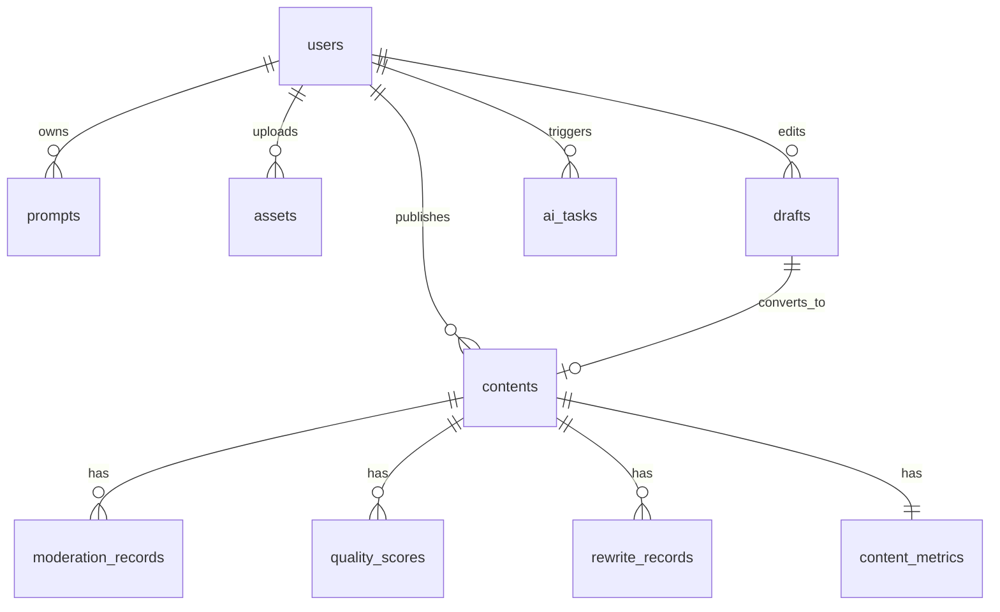

# 数据库：数据模型设计

## 设计原则

- PostgreSQL 保存核心关系数据和业务状态。
- JSONB 保存审核输出、质量评分细节、素材列表、富文本结构等半结构化内容。
- Redis 保存榜单排序、计数缓存、短期详情缓存和限流数据。
- 所有状态字段使用共享枚举，避免前端、后端、数据库不一致。
- 所有用户写入数据保留 `created_at`、`updated_at`，软删除使用 `deleted_at`。

## 核心实体关系



## 表规划

### users

用户、邮箱、密码哈希、角色和状态。

```text
id
email
password_hash
username
avatar_url
role              reader | creator | operator
status            active | disabled
created_at
updated_at
```

索引：

- unique: `email`
- index: `status`

### prompts

Prompt 模板和变量定义。

```text
id
owner_id
name
category
template
variables
is_system
version
usage_count
created_at
updated_at
deleted_at
```

索引：

- index: `owner_id + updated_at`
- index: `category + is_system`

### assets

用户素材、对象存储地址和 AI 描述。

```text
id
user_id
type              image | document | link
url
storage_key
name
tags
ai_description
metadata
created_at
updated_at
deleted_at
```

索引：

- index: `user_id + created_at`
- index: `type`

### drafts

云端草稿和同步版本。

```text
id
user_id
title
content
content_json
assets
version
status            active | archived | deleted
last_synced_at
created_at
updated_at
deleted_at
```

索引：

- index: `user_id + updated_at`
- index: `user_id + status`

### contents

待审核、已发布或已下线内容。

```text
id
author_id
draft_id
title
summary
content
content_json
cover_url
assets
status            draft | reviewing | need_rewrite | rejected | approved | published | offline
quality_score
safety_score
hot_score
recommend_score
published_at
created_at
updated_at
```

索引：

- index: `status + published_at`
- index: `status + hot_score`
- index: `status + recommend_score`
- index: `author_id + updated_at`

### content_versions

内容二次编辑、复审和回滚历史。PDF 将内容下线、撤回、回滚列为进阶挑战，因此当前只做预留设计。

```text
id
content_id
version
title
content
content_json
change_summary
created_by
created_at
```

### moderation_records

审核记录和 AI 原始输出摘要。

```text
id
content_id
user_id
risk_level        low | medium | high
decision          pass | need_rewrite | reject
categories
risk_spans
rule_hits
ai_reason
suggestions
raw_ai_output
rule_version
prompt_version
model_name
created_at
```

索引：

- index: `content_id + created_at`
- index: `decision + created_at`
- index: `risk_level + created_at`

### quality_scores

内容质量评分维度。

```text
id
content_id
total_score
originality_score
readability_score
structure_score
value_score
title_score
image_text_match_score
compliance_score
level
reasons
improvements
raw_ai_output
created_at
```

### rewrite_records

合规改写记录。

```text
id
content_id
user_id
source_title
source_content
rewritten_title
rewritten_content
changed_spans
reason
prompt_version
model_name
created_at
```

### content_metrics

内容计数聚合。

```text
content_id
view_count
like_count
share_count
updated_at
```

索引：

- primary key: `content_id`
- index: `updated_at`

### feedbacks

用户反馈明细。该表属于进阶挑战预留，用于后续接入收藏、举报、不感兴趣等动态排序因子；MVP 可先不建表，只使用 `content_metrics`。

```text
id
user_id
content_id
type              collect | report | dislike
value
metadata
created_at
```

索引：

- unique: `user_id + content_id + type`
- index: `content_id + type`
- index: `user_id + created_at`

### ai_tasks

AI 任务审计和成本统计。

```text
id
user_id
task_type         generate | moderate | score | rewrite | image_prompt
status            pending | success | failed
input_hash
input_summary
output_summary
model_provider
model_name
prompt_id
prompt_version
temperature
token_input
token_output
duration_ms
error_code
error_message
created_at
updated_at
```

### audit_rules

内容审核规则库。

```text
id
category
pattern_type      keyword | regex
pattern
risk_level        low | medium | high
action            warn | rewrite | reject
description
version
enabled
created_at
updated_at
```

索引：

- index: `category + enabled`
- index: `risk_level + action`

## Redis Key 规划

```text
ranking:hot                  热点榜 Sorted Set
ranking:viral                爆文榜 Sorted Set
ranking:recommend            推荐榜 Sorted Set
feed:home                    首页信息流缓存列表或 Sorted Set
content:metrics:{id}         内容计数缓存
content:detail:{id}          内容详情短缓存
rate-limit:ai:{userId}       AI 调用限流
rate-limit:login:{ip}        登录限流
task:{taskId}                预留任务状态，MVP 可不启用
```

## 迁移与 seed 建议

Prisma 目录建议：

```text
prisma/
├── schema.prisma                  # Prisma 数据模型
├── migrations/                    # 数据库迁移目录
└── seed.ts                        # 演示数据 seed
```

Seed 数据：

- 一个演示用户。
- 5 到 10 个系统 Prompt。
- 10 条素材。
- 3 篇正常内容。
- 3 篇违规待改写内容。
- 30 到 50 条已发布内容。
- 一批阅读量、点赞量和分享量数据。

## 数据安全

- 密码只保存 bcrypt hash。
- AI 日志不保存完整敏感原文，保存摘要、hash 和输出结构。
- 软删除数据不在普通列表中返回。
- 用户只能访问自己的草稿、素材和个人 Prompt。
- C 端内容前台允许匿名浏览；涉及点赞、分享去重等互动时可使用 `reader` 登录态或匿名设备标识。
- B 端创作者后台需要 `creator` 角色校验，用户只能管理自己的草稿、素材、Prompt 和内容。
- `operator` 角色只为后续平台运营后台预留，不进入当前 MVP 主链路。
