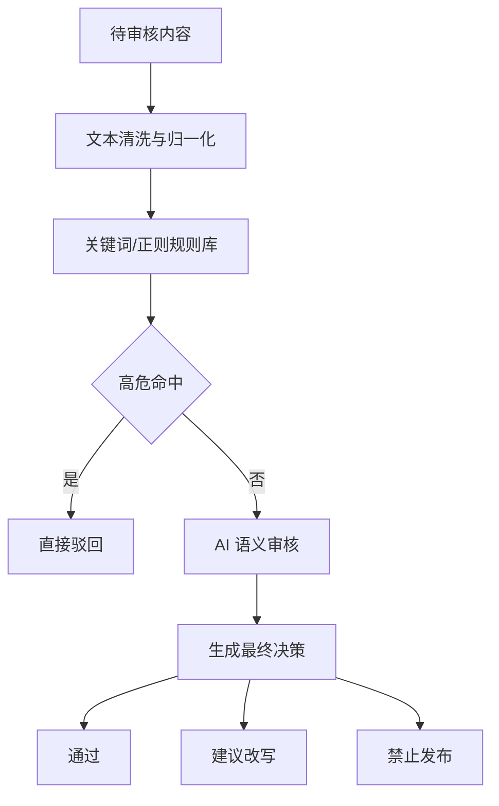

# AI：内容安全规则库

## 设计目标

内容安全规则库用于给 AI 审核提供确定性兜底。规则库处理高确定性风险，AI 处理语义判断、片段解释和改写建议，两者结合后形成发布前安全拦截。

## 审核分层



## 风险等级

`low`：

- 风险较低，允许发布。
- 可记录提示或轻微降权。
- 示例：表达质量低、标题夸张但不违规。

`medium`：

- 不建议直接发布。
- 需要改写后复审。
- 示例：边界表达、诱导性描述、低俗倾向、广告倾向。

`high`：

- 禁止发布。
- 需要删除或大幅改写。
- 示例：明确违法违规、诈骗引导、敏感隐私泄露、高危导流。

## 规则动作

```text
warn       记录风险，不阻止发布
rewrite    建议改写，复审后可发布
reject     直接驳回，禁止发布
```

决策矩阵：

| 规则命中 | AI 风险 | 最终决策 |
| --- | --- | --- |
| reject | 任意 | reject |
| rewrite | high | reject |
| rewrite | medium | need_rewrite |
| warn | low | pass |
| 未命中 | high | reject |
| 未命中 | medium | need_rewrite |
| 未命中 | low | pass |

## 规则表结构

```text
id
category
pattern_type      keyword | regex
pattern
risk_level        low | medium | high
action            warn | rewrite | reject
description
version
enabled
created_at
updated_at
```

## 风险类别

建议先覆盖以下类别：

- pornography：涉黄低俗。
- gambling：赌博博彩。
- drugs：涉毒。
- fraud：诈骗和虚假引导。
- violence：暴力或极端内容。
- privacy：手机号、身份证号、地址等隐私泄露。
- illegal_trade：非法交易。
- medical_claim：夸大医疗效果。
- financial_risk：高风险投资诱导。
- spam_ad：垃圾广告和站外导流。

## 审核记录

审核结果写入 `moderation_records`：

```json
{
  "riskLevel": "medium",
  "decision": "need_rewrite",
  "categories": [
    {
      "category": "spam_ad",
      "confidence": 0.88,
      "reason": "存在明显导流倾向"
    }
  ],
  "riskSpans": [
    {
      "text": "疑似风险片段",
      "start": 12,
      "end": 20,
      "category": "spam_ad",
      "severity": "medium",
      "suggestion": "改为平台内中性描述"
    }
  ],
  "ruleHits": [],
  "summary": "内容存在中风险表达，建议改写后复审。",
  "suggestions": ["删除诱导性表述", "补充客观说明"]
}
```

## 前端展示

审核结果页应展示：

- 总体风险等级。
- 最终决策。
- 安全分。
- 风险类别。
- 风险片段高亮。
- 规则命中说明。
- AI 审核理由。
- 修改建议。
- 一键合规改写入口。

高风险内容：

- 发布按钮禁用。
- 展示驳回原因。
- 可允许用户修改后重新提交审核。

中风险内容：

- 发布按钮禁用。
- 展示“合规改写”按钮。
- 改写后重新提交审核。

## 规则版本化

规则库必须带版本号：

- `audit_rules.version`：单条规则版本。
- `moderation_records.rule_version`：审核时使用的规则集版本。
- `moderation_records.prompt_version`：审核 Prompt 版本。

价值：

- 可解释历史审核结果。
- 可回滚误杀规则。
- 可对比新旧规则命中率。

## 评估指标

建议准备 100 条左右人工标注样例，覆盖正常、涉黄、涉赌、涉毒、诈骗、广告、隐私、低俗等类别。

核心指标：

- 高危样例召回率。
- 正常样例误杀率。
- 中风险识别率。
- 风险片段定位可用率。
- 改写建议采纳率。

答辩目标可以设定为：高危样例识别率不低于 90%，并展示典型误判案例和后续优化方向。
