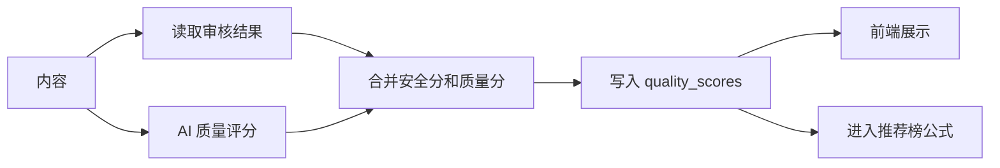

# AI：质量评分体系

## 设计目标

质量评分用于判断内容是否值得分发，并为创作者提供可执行的优化建议。评分结果不仅展示在审核结果页，还会进入推荐榜排序公式。

## 评分维度

| 维度 | 权重 | 说明 |
| --- | ---: | --- |
| 原创性 | 15% | 内容是否避免模板化、重复和空泛表达。 |
| 可读性 | 15% | 语言是否顺畅、段落是否易读。 |
| 结构完整度 | 15% | 是否有清晰开头、主体、结尾和逻辑层次。 |
| 信息价值 | 20% | 是否提供观点、案例、步骤、经验或实用信息。 |
| 标题质量 | 10% | 标题是否准确、有吸引力且不过度夸张。 |
| 图文匹配 | 10% | 配图建议或素材是否与内容主题一致。 |
| 合规性 | 15% | 是否低风险、无明显违规和诱导表达。 |

总分计算：

```text
totalScore =
  originalityScore * 0.15
  + readabilityScore * 0.15
  + structureScore * 0.15
  + valueScore * 0.20
  + titleScore * 0.10
  + imageTextMatchScore * 0.10
  + complianceScore * 0.15
```

## 等级划分

```text
S: 90-100，优质内容，推荐优先展示
A: 80-89，质量较好，正常推荐
B: 70-79，可发布，但建议优化
C: 60-69，质量一般，推荐降权
D: 0-59，不建议发布或需要重写
```

## 输出结构

```json
{
  "totalScore": 86,
  "originalityScore": 82,
  "readabilityScore": 90,
  "structureScore": 85,
  "valueScore": 88,
  "titleScore": 84,
  "imageTextMatchScore": 80,
  "complianceScore": 95,
  "level": "A",
  "reasons": ["结构完整", "表达流畅"],
  "improvements": ["增加案例", "强化结尾行动建议"]
}
```

## 评分流程



## 合规分与审核关系

- 审核高风险：`complianceScore` 建议不高于 40，内容不能发布。
- 审核中风险：`complianceScore` 建议在 40 到 70，必须改写复审。
- 审核低风险：`complianceScore` 可在 80 以上，根据内容质量调整。

评分系统不替代审核系统。审核负责“能不能发布”，评分负责“值不值得分发”。

## 前端展示

质量评分面板建议包含：

- 总分和等级。
- 七个维度的雷达图或进度条。
- 评分理由。
- 可执行改进建议。
- 与榜单排序的关系说明，例如“质量分较高，有助于推荐榜排序”。

## 校准策略

- 准备 20 到 50 篇不同质量层级的样例内容。
- 人工给出参考评分。
- 对比 AI 分数和人工分数差异。
- 调整 Prompt 和权重。
- 记录 Prompt 版本和评估结果。

## 降级方案

AI 评分失败时，可以使用启发式评分兜底：

- 标题长度适中加分。
- 段落数量合理加分。
- 字数过少扣分。
- 审核中风险扣分。
- 缺少摘要或标签扣分。
- 复审失败或审核高风险内容扣分。

启发式评分必须标记 `scoreSource = heuristic`，避免和 AI 评分混淆。
